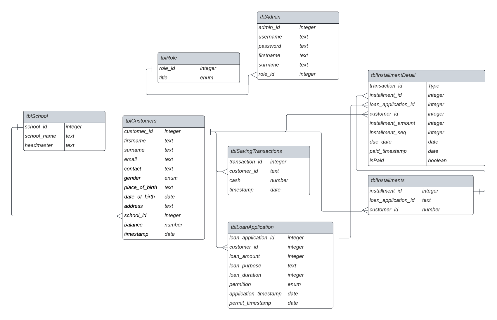
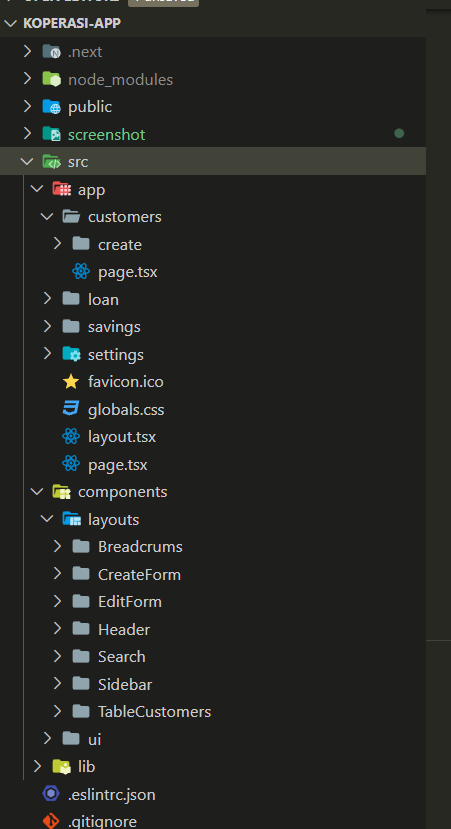

## 1. Project Description

Application for recording customer savings and loan. This is web-based application for recording customer transactions for savings and loans at Pendidikan Sains Averos Foundation cooperation with customers being employees of the foundation.

## 2. Technology

The project is built using several technologies:

1. [NextJs](https://nextjs.org/): Framework for the web application. Makes it easy to route between web pages based on Single Page Application (SPA).
2. [Tailwind](https://tailwindcss.com/): Framework for UI design. There are many classes that have been defined and are ready to use.
3. [Shadcn UI](https://ui.shadcn.com/): Designed components that can be directly used to build a UI.
4. [Railway](https://railway.app/): Online platform used as a database service to store application's data such as customer's data, transactions, loans, user's accounts etc. The database service used in Railway is PostgreSQL.

## 3. Dependencies

1. [clsx](https://www.npmjs.com/package/clsx): Package for organizing CSS class's logic (conditional CSS rendering). For example, if the menu for the route is the same as the current URL, the menu will be active.
2. typescript: Package to ensure the data received matches the specified data type
3. [zod](https://zod.dev/): Package to validate when filling out the form
4. [react-icon](https://react-icons.github.io/react-icons/): Package for adding reusable icon components
5. [prisma](https://www.prisma.io/): Package for interacting with the database on railway (postgreSQL)
6. [Next Auth](https://next-auth.js.org/): User authentication to be able to use application's features

## 4. Database's Structure

This is a database design that is used to store some data.

## 5. Application's Structure

Main folder is `./src`. Folders in `./src/app` as a routes to move between menus in the application where each route will have a main file called `page.tsx`.

The `./src/components` folder contains components that can be reusable in the application.
