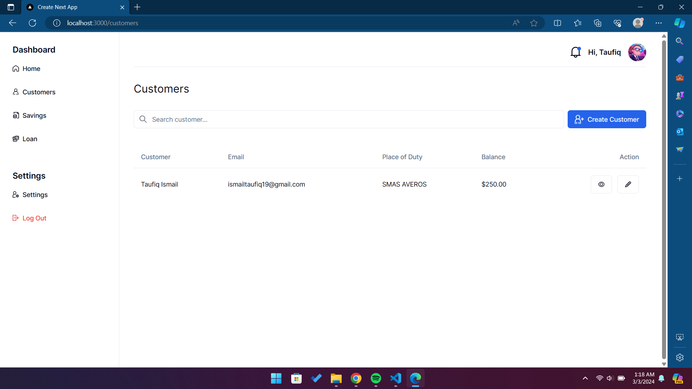

## 1. Project Description

Application for recording customer savings and loan. This is web-based application for recording customer transactions for savings and loans at Pendidikan Sains Averos Foundation cooperation with customers being employees of the foundation.

Link to the video: bla bla bla

## 2. Requirements

Prepare the installed application requirements first.

1. Install [Node.js](https://nodejs.org/en)
   in this project using Node.js version 20.10.0

## 3. Getting Started

1. Visit the project repository using the following link: https://github.com/3ramayana/koperasi-app
2. Download the project by clicking the green button then selecting Download ZIP
3. Extract the downloaded project zip file
4. Open project using code editor (VSCode)
5. Open a terminal in a code editor with the shortcut `ctrl+backticks`
6. Run the following command to install dependencies and devDependencies in the project. Wait until it's finished
   ```sh
   npm install
   ```
7. Run the following command to run the development server
   ```sh
   npm run dev
   ```
8. Open [http://localhost:3000](http://localhost:3000) with your browser to see the result.



## 4. QnA

1.  **Q: Does admin need to login?**

    _A: Yes, admin needs to log in to make transactions and manage customer data._

2.  **Q: Can users register an account??**

    _A: No, users cannot register an account. Admin accounts are created by superadmin._
